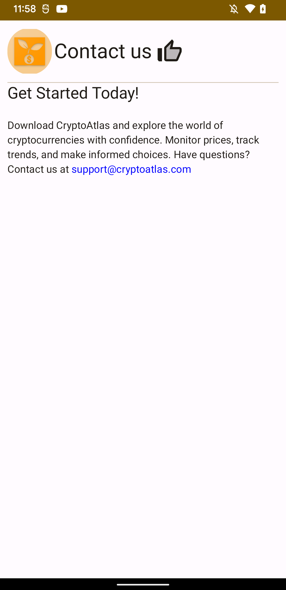

# CryptoAtlas

CryptoAtlas is a comprehensive cryptocurrency tracking app that allows users to explore and monitor
data for various cryptocurrencies from around the world. It provides real-time information, price
trends, historical data, and other essential details for each coin, making it a valuable tool for
crypto enthusiasts, investors, and traders.

## Features

- 💸 **Extensive Coin Listing**: Access an extensive list of cryptocurrencies from different
  exchanges and tokens available in the market.

- 📈 **Real-Time Data**: Get up-to-date information on cryptocurrency prices, market capitalization,
  trading volume, and more.

- 📊 **Detailed Coin Pages**: View detailed pages for each cryptocurrency, showcasing historical
  price charts, market performance, and key statistics.

- ⭐ **Favorite Coins**: Mark coins as favorites to keep track of your preferred cryptocurrencies in
  one place.

## Screenshots

## Getting Started

1. Clone the repository: `git clone https://github.com/your-username/CryptoAtlas.git`
2. Install the required dependencies: `npm install`
3. Start the development server: `npm start`

## Contributing

We welcome contributions from the open-source community! If you'd like to contribute to CryptoAtlas,
please follow these steps:

1. Fork the repository.
2. Create a new branch: `git checkout -b feature/your-feature`
3. Make your changes and commit them: `git commit -m "Add your message here"`
4. Push to the branch: `git push origin feature/your-feature`
5. Submit a pull request.

Please ensure your code follows the project's coding standards and includes appropriate tests.

## License

This project is licensed under the [MIT License](LICENSE).

## Contact

If you have any questions or suggestions regarding the app, please feel free to contact us at .

Happy crypto tracking with CryptoAtlas!

---
